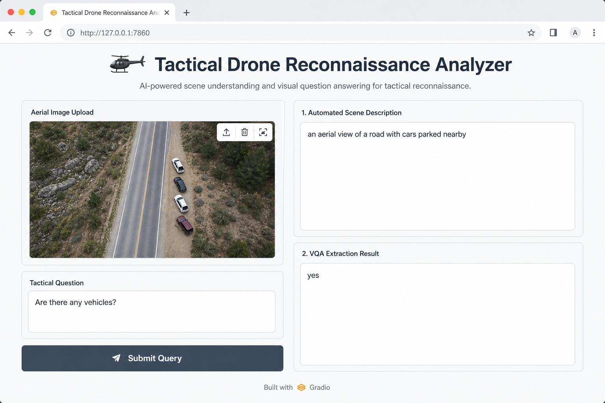
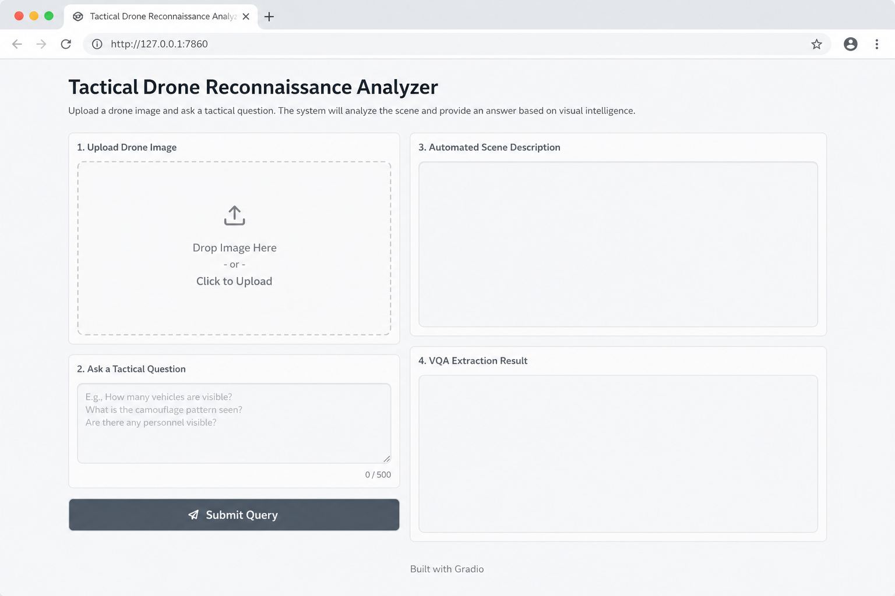

# 🚁 Tactical Drone Reconnaissance Analyzer

> A smart aerial reconnaissance assistant powered by Salesforce **BLIP** models — auto-captions scenes on upload, then answers your tactical visual questions (VQA).

<br>

<p align="center">
  
  
  
  
  
</p>

---

## Demo Preview

<p align="center">
  
</p>

<p align="center">
  <em>Upload an aerial image → get an instant scene caption → ask a tactical question → get a VQA answer.</em>
</p>

<details>
<summary><strong>Empty UI (before upload)</strong></summary>
<br>
<p align="center">
  
</p>
</details>

---

## What Does It Do?

Upload an aerial / drone image and the app runs two independent steps:

| Step | What happens | Model |
|:----:|--------------|-------|
| **1** | Instant scene description as soon as the image is uploaded | `Salesforce/blip-image-captioning-base` |
| **2** | Targeted answer to a tactical question you type | `Salesforce/blip-vqa-base` |

The workflows are **decoupled**: captioning does not wait for a question, and asking a question does not re-run the captioner.

---

## How It Works

```
┌──────────────────┐
│  Upload aerial   │
│  reconnaissance  │
│  image           │
└────────┬─────────┘
         │  upload event
         ▼
┌──────────────────────────────┐
│  BLIP Captioning             │
│  → automated scene summary   │
└──────────────────────────────┘

         + tactical question
         │  click / Enter
         ▼
┌──────────────────────────────┐
│  BLIP VQA                    │
│  → visual answer extraction  │
└──────────────────────────────┘
```

### Technical details

- **Device:** `CUDA` when available, otherwise `CPU`
- **Precision:** `float16` on GPU (memory-efficient), `float32` on CPU
- **UI:** Gradio Blocks with Soft theme (`slate` / `gray`)
- **Sharing:** `demo.launch(share=True)` creates a public Gradio link — ideal for Colab

---

## Project Structure

```
.
├── app.py                 # Full app (models + Gradio UI)
├── requirements.txt       # Dependencies
├── assets/
│   ├── demo-screenshot.png
│   └── ui-overview.png
└── README.md
```

---

## Run on Google Colab

### 1. Enable a GPU (recommended)

`Runtime` → `Change runtime type` → **T4 GPU** (or any available GPU)

### 2. Install dependencies

```bash
!pip install -q -r requirements.txt
```

Or install directly:

```bash
!pip install -q "transformers>=4.56,<6" torch torchvision accelerate gradio Pillow
```

### 3. Launch the app

```bash
!python app.py
```

After the models load, Gradio prints a public URL similar to:

```
Running on public URL: https://xxxx.gradio.live
```

Open the link and upload an aerial image to try it.

---

## Run Locally

```bash
# Optional virtual environment
python -m venv .venv
source .venv/bin/activate          # Linux / macOS
# .venv\Scripts\activate           # Windows

pip install -r requirements.txt
python app.py
```

Then open the local URL or the public share link shown in the terminal.

---

## Dependencies

| Package | Purpose |
|---------|---------|
| `transformers` | Load and run BLIP models |
| `torch` / `torchvision` | GPU / CPU inference |
| `accelerate` | Efficient model loading |
| `gradio` | Interactive web UI |
| `Pillow` | Image processing |

---

## Example Tactical Questions

After uploading an image, try:

- `Are there any vehicles?`
- `How many people are visible?`
- `Is there a building in the image?`
- `What color is the largest object?`
- `Are there any roads or paths?`

---

## UI Workflow

1. **Upload an image** → the auto-caption appears in *Automated Scene Description*
2. **Type a question** in *Tactical Question*
3. Click **Submit Query** (or press Enter) → the answer appears in *VQA Extraction Result*

---

## Notes

- First run downloads both models from Hugging Face and may take a few minutes
- A GPU speeds up inference and reduces memory use via `float16`
- Missing image or empty question returns clear error messages in the UI
- Built for experimentation and visual analysis — not a certified operational ISR system

---

## Models & Licensing

Models used (Salesforce via Hugging Face):

- [blip-image-captioning-base](https://huggingface.co/Salesforce/blip-image-captioning-base)
- [blip-vqa-base](https://huggingface.co/Salesforce/blip-vqa-base)

Check each model page for license terms before commercial use.

---

<p align="center">
  <sub>Built for rapid aerial image analysis · Powered by BLIP + Gradio</sub>
</p>
